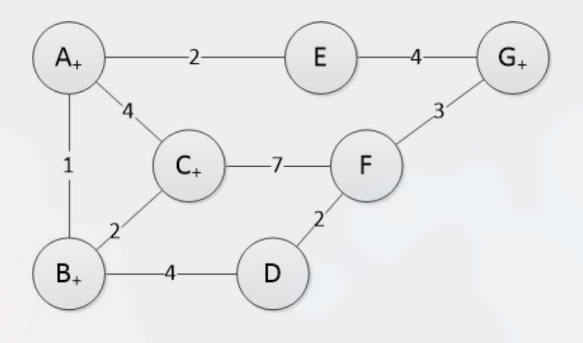

# ETSF10, 2023-04-24

## Question 1

**Given an Ethernet link with two hosts `{A,B}`, one at each end, with the following properties:**

| Property                    | Value                           |
| --------------------------- | ------------------------------- |
| Link bit rate               | 1 Gbps                          |
| Link cable length           | 200 m                           |
| Ethernet header length      | 26 Byte                         |
| Maximum Ethernet frame size | 1526 Byte (incl. header)        |
| Minimum Ethernet frame size | 72 Byte (incl. header)          |
| Backoff scheme              | Binary exponential `{0.....29}` |
| Wave propagation velocity   | 2 × 108 m/s          |

**Mark the true statements. Note that wrong answers yield -1 points each.**

1. **There may be collisions on the link since the Carrier Detection mechanism (CD) does not work with these parameters.**

> 💡  In order for carrier detection to function, the frame transmission time must be equal to or greater than 2 × Dp, where Dp is the propagation delay.

- Propagation delay:  
  time = distance / velocity  
  = 200 / (2 × 108)  
  = 1 × 10-6 s = 1 microsecond  
  → 2 × Dp = 2 microseconds

- Transmission time with min frame size:  
  72 * 8 = 576 bits  
  Transmission time = 576 / 1 000 000 000 = 0.576 microseconds

The frame transmission time is not equal to or greater than 2 × Dp. The statement is therefore **correct**.

2. **If both hosts tried to transmit simultaneously and there was a collision, the next transmission attempt will be successful because of the exponential backoff.**

> 💡  Binary exponential backoff involves both hosts retransmitting their frames after a *random* amount of time. This doesn't guarantee a successful retransmission since both randomly selected times could together lead to yet another collision.

The statement is **incorrect**.

3. **The maximum theoretically achievable data rate is less than 1 Gbps.**

> 💡  When transmitting, all of the bits sent are not payload data. In Ethernet, we need headers. Additionally, nodes using Ethernet must allow for an interpacket gap, which is usually set to 12 bytes. This means that actual packets aren't constantly being sent over the link.

The statement is **correct**.

4. **If the link length is shortened to 10 m, the maximum achievable data rate will increase.**

> 💡  The mention of a backoff scheme implies this is a _half-duplex_ Ethernet link, where hosts resends collided packets after a random backoff (as mentioned before). In half-duplex mode, the **cable length directly impacts efficiency due to the collision detection window**. Longer cables increase the collision window since the propagation delay is longer.  

The statement is **correct**.

5. **If the maximum allowable frame length would increase to 2048 Byte, the maximum achievable data rate would increase.**

> 💡  If frame lengths increased, the "data-to-header" ratio would increase, leading to an increased data rate.

The statement is **correct**.

## Question 2

**Given the network in the figure with link costs as indicated:**

**Calculate Dijkstra's Shortest Path First algorithm starting from node A.**

> 💡 Dijkstra's algorithm, in the course book known as the _Link-State (LS) Algorithm_. We will create a table with one column for "visited" nodes, and one column for each individual node, where we will update the closest path cost (and the previous node in the path) as we iterate through the nodes. I recommend reading about this algorithm in chapter 5, but very simply put, we do the following.
>
> 1. Add initial costs to the neighbours of our start node.
> 2. Look at all unvisited nodes with a calculated cost in our table. Pick the one with the least cost (`N`) and add it to `Visited` in the next iteration.
> 3. Now, in the new iteration, for each neighbor of `N`, update its cost if the path via `N` is shorter.
> 4. Repeat from step `2.` until all nodes are visited.

| Visited | A   | B    | C    | D    | E    | F     | G    | Comment                                    |
| ------- | --- | ---- | ---- | ---- | ---- | ----- | ---- | ------------------------------------------ |
| A       | 0   | 1, A | 4, A | -    | 2, A | -     | -    | We pick `B`. Why not `A`? Already visited. |
| AB      |     |      | 3, B | 5, B |      | -     | -    | `E` is next.                               |
| ABE     |     |      |      |      |      | -     | 6, E | Lowest cost from `{C, D, G}`? `C`!         |
| ABEC    |     |      |      |      |      | 10, C |      |
| ABECD   |     |      |      |      |      | 7, D  |      |
| ABECDG  |     |      |      |      |      |       |      |
| ABECDGF |     |      |      |      |      |       |      |

> 💡  By looking at the latest value for any given destination, we can back-track our way back to `A` using the node letter next to the cost.

**Mark the true statements. Note that all correct answers have to be selected and a wrong answer yields 0 points.**

1. **All routes from node A are listed in the table below:**

| Node | Cost | Via  |
| ---- | ---- | ---- |
| B    | 1    | -    |
| C    | 3    | B    |
| D    | 5    | B    |
| E    | 2    | -    |
| F    | 7    | B, D |
| G    | 6    | E    |

> 💡  We'll compare these values with those in our table. For example, for node `F`, the assignment claims the path starting with `A` consists of nodes `B` and `D`. In our table, let's look at the latest entry for `F`, our destination. We see that its latest hop is `D`. Great. What's the latest hop of `D`? According to our table, it's `B`. Wonderful.

The statement is **correct**.

2. **The route to F traverses 3 links, the longest considering the number of hops.**

> 💡  We can check with our table again, sure, but given that the last statement is correct, this one must also be correct. `A-B`, `B-D` and finally `D-F`.

The statement is **correct**.

3. **The nodes are added to the permanent list in the following order: A, B, E, C, D, G, F.**

> 💡  Compare it to how we added nodes to our `Visited` column.

The statement is **correct**.

4. **The lowest cost route from A to C goes via B at a cost of 3.**

> 💡  Consulting our table, yes! That makes sense.

The statement is **correct**.

## Question 3

**Circle the correct answer based on the claim and reason below:**

**Claim: IEEE 802.11 specifies a larger header than IEEE 802.3 with among other things the need for more address fields.**

**Reason: Further address fields are needed since the wireless link only makes up part of the full connection. The full connection can be made up of both wireless and wired links.**

> 💡  It's important to know that `IEEE 802.11` and `IEEE 802.3` are the standards for Wi-Fi and Ethernet respectively.

1. **Both the claim and the reason are correct propositions and the reson correctly explains the claim.**
2. **Both the claim and the reason are correct propositions, but the reson does not correctly explain the claim.**
3. **The claim is correct but the reason is an incorrect proposition.**
4. **The claim is false but the reason is a correct proposition.**
5. **Both the claim and the reason are incorrect propositions.**

> 💡  Ethernet frames only travel on a single link. From one Ethernet-capable device to another. Therefore the only addresses included in the header are MAC destination and MAC source. For Wi-Fi on the other hand, a frame can indeed travel through several links, wired and wireless, on its way to its destination. For that reason, Wi-Fi frames additionally store a _Receiver Address_ and _Transmitter Address_ (unique to the current link being traversed).

The correct answer is option `1.`.

## Question 4

**Circle the correct answer based on the claim and reason below:**

**Claim: When using CSMA/CA, a station S that wants to transmit requests access to the channel by issuing a Request to Send (RTS) message. Only when all stations have acknowledged the request by issuing a Clear to Send (CTS) message each can S start to transmit.**

> 💡  While this might intuitively seem logical, it's not entirely true. The station, `S`, actually **only needs to await the CTS message from the intended receiver** in order to start transmitting.

**Reason: A station that overhears a RTS message must answer with a CTS message to acknowledge the reception of the RTS, even if it is not the recipient of the following data frame. This is to ascertain that all other stations than the one issuing the RTS refrains from transmission and collisions are avoided.**

> 💡  Once again, this seems like it could make sense, but in reality stations that overhear RTS messages don't respond. They can however internally acknowledge the transmission **if they overhear the intended recipients CTS message**.

1. **Both the claim and the reason are correct propositions and the reson correctly explains the claim.**
2. **Both the claim and the reason are correct propositions, but the reson does not correctly explain the claim.**
3. **The claim is correct but the reason is an incorrect proposition.**
4. **The claim is false but the reason is a correct proposition.**
5. **Both the claim and the reason are incorrect propositions.**

The correct answer is option `5.`.

## Question 5

**Given this unsorted forwarding table, answer questions a, b and c:**

| Net ID            | Next hop     |
| ----------------- | ------------ |
| 130.235.0.0/16    | 81.12.32.4   |
| 191.231.194.0/26  | 129.100.1.1  |
| 84.24.0.0/22      | 181.14.62.5  |
| 100.100.12.160/27 | 4.235.17.9   |
| 191.231.194.0/24  | 73.32.56.123 |
| 0.0.0.0/0         | 112.123.89.1 |

**What is the next hop for these destination addresses?**

a) **84.27.123.21**

> 💡  So the general strategy is that we match the prefix of the IP addresses. If we have several matches, we pick the one with the _longest shared prefix_. In this case, we actually **don't match with anything except `0.0.0.0/0`**, where **zero bits identify the subnet**, so everything that hasn't matched with a longer prefix goes here.

Answer: `112.123.89.1`

b) **191.231.194.72**

> 💡  This one is a bit trickier. At first glance, it looks like we'd match with `191.231.194.0/26`. But looking at the subnet mask, `/26`, we note that the two first bits in the last octet take part in identifying the subnet. Since the value of the octet is zero, **these two bits must be zeros in order to match**. With our incoming destination address, our last octet has the value of `72`, which **can't be represented in binary without flipping the second bit to a one**! Instead, we match with `191.231.194.0/24`, where only the first three octets (24 bits) are used in identifying the subnet.

Answer: `73.32.56.123`

c) **100.100.12.187**

> 💡  Here, we match with `100.100.12.160/27`. We can show this by first examining the subnet mask. **The three first bits in the last octet** help defining the subnet. In order to reach a value of `160`, they'd have to be `101`. With the last octet of the destination address having a value of `187`, the first three bits would also be `101`, so it fits!

Answer: `4.235.17.9`

## Question 6

**Circle the correct answers below:**

**Which routers can use the Shortest Path First tree shown below to construct a valid routing table for all destinations in the network?**

1. **Router 1**
2. **Router 2**
3. **Router 3**
4. **Router 4**
5. **Router 5**

> 💡  A router can only use a given SPT (Shortest Path Tree) to generate valid routing entries if that router is the root of the SPT.\
> — **ChatGPT**

Answer: **Router 1**