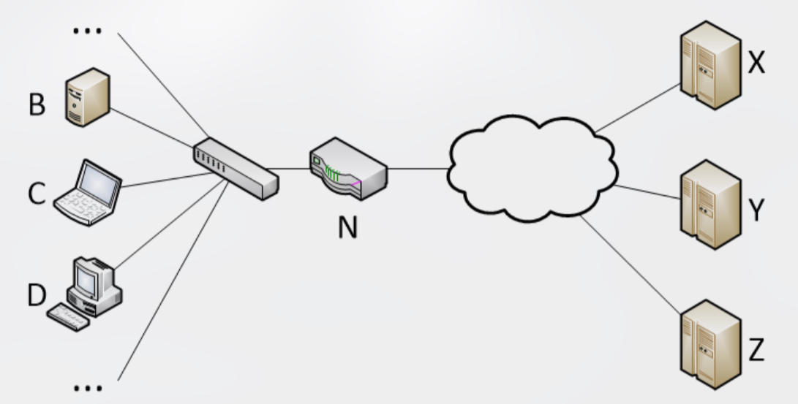
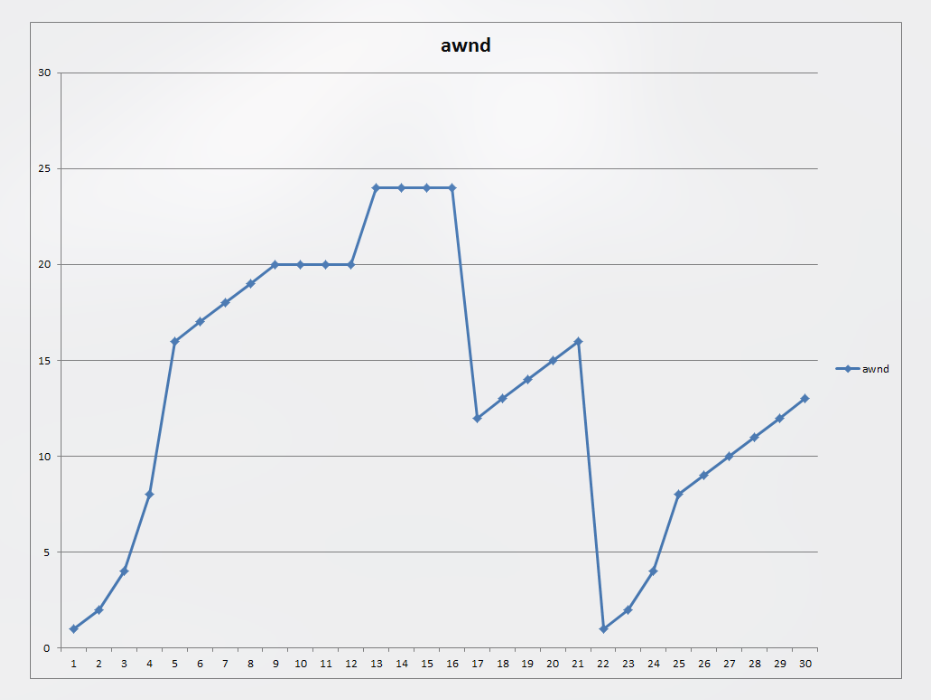

# ETSF10, 2023-05-08

## Question 1

**The data rate on a link is 10 Mbps. Two hosts communicate using a sliding window scheme. In order to be able to cope with the transmission without buffer overflow, the receiver’s maximum advertised window size is 8000 bytes. Calculate the link RTT.**

> 💡 To solve this assignment, we use the _Bandwidth-Delay Product_ (BDP). The BDP represents the maximum amount of data that can be in transit on the link at any given time without causing buffer overflow, and is the product of the link's _Data Rate_ (R) and the _Round Trip Time_ (RTT). **The maximum window size (W) should be equal to the BDP to prevent buffer overflow**.

W = BDP = R × RTT

Solving for RTT:

RTT = W / R = 64 000 / 10 000 000 = 0.0064 s

Answer: **6.4ms**

## Question 2

**Below, a number of cases are described. Match one of the transition strategies to each case. A wrong answer yields -1 points (down to zero points).**

**Transition strategies:**

-  **Tunnelling mode** 
-  **Deploy header translation**
-  **Deploy dual stack**

1. **A host in an IPv4-only domain need to connect to an IPv6-only host. The IPv4-only domain and the IPv6-only domain are connected**

> 💡 For this one I used the method of exclusion. _Tunnelling mode_ refers to an IPv6 host communicating with another IPv6 host **across IPv4-only routers**. _Deploy dual stack_  refers to when a node supports both IPv4 and IPv6 simultaneously. I wasn't familiar with the use-case of _Deploy header translation_, but that's the only once left.

Answer: **Deploy header translation**

2. **A host is connected to a network that supports both IPv4 and IPv6. The host needs to connect to both IPV4-only and IPv6-only end-nodes.**

> 💡 As described above ^^

Answer: **Deploy dual stack**

3. **A router connects an IPv4-only domain with an IPv6-only domain.**

> 💡 Intuitively I thought about dual stack again here, but then a wise chatbot told me that dual stack is when **a single host** supports both IPv4 and IPv6, but here we have two separate domains! The router itself must **translate** between the two protocols.

Answer: **Deploy header translation**

4. **A local network has a mixture of IPv6-only and IPv4-only services on many end-nodes.**

> 💡 We're now talking about **one single network** supporting both IPv4-only and IPv6-only devices. While header **translation may work**, **dual stack is the cleaner strategy**.

Answer: **Deploy dual stack**

5. **A host in an IPv6-only domain needs to connect to an IPv6-only host in another domain. In the path between the two end domains there is an IPv4-only domain.**

> 💡 As I mentioned in my first comment of this assignment, this is a textbook tunneling mode case. We have two IPv6-only hosts communicating across a network with an IPv4-only bottleneck node. Tunneling mode **encapsulates our IPv6 data i IPv4 datagrams temporarily**, which works here.

Answer: **Tunneling mode**

## Question 3

**Given a congestion windows (cwnd) of 12 segments and a receiver windows of 16 000 bytes. How many fully utilised segments (disregard segments smaller than MSS) is the host allowed to send if the maximum segment size (MSS) is 1500 bytes?**

> 💡 The _Receiver Window_ (RWND) limits how much data the sender can transmit before waiting for an acknowledgement. There are two steps involved in solving this assignment. First, we must figure out how how many segments fit in the RWND, then we must take the minimum value between that and the _Congestion Window_ (CWND). This is known as the _Effective Window_.

RWND (in segments) = RWND (in bytes) / MSS (also in bytes) = 16 000 / 1 500 = 10.66666... meaning **10 whole segments**.

Effective Window = min(CWND, RWND) = min(12, 10) = 10 segments

Answer: **10 segments**

## Question 4

**This question is about NAPT, Network adress translation with port translation.**

**Given the figure above. The hosts addresses are given below.**

`B = 192.168.1.11`\
`C = 192.168.1.12`\
`D = 192.168.1.13`

`X = 201.10.3.14`\
`Y = 13.85.34.123`\
`Z = 145.234.10.73`

**N is the router/NAT and the address translator has only one public external address.**

**Add partitial entries to router N's NAPT table as the following events take place in numbered order. Note that the allocated external addresses is not included in your answer.**

**Note! The notion 'Unused port' indicates a not yet allocated port number.**

1. **B connects to the web server at Z.**

> 💡 This is an _outbound connection_, meaning that a host in our local network initiates the connection with an external host. This is totally fine without a port forwarding rule, but does require the NAT-router to create a new entry mapping together internal and external port. The destination port is `80`, since we're connecting to a web server (HTTP defaults to `80`). However, for the port mapping, the router will pick two **independant random unused** ports and map them together. The internal IP address is trivial.

Internal IP address: `192.168.1.11` (`B`'s address)\
Internal port: `:unused`\
External port: `:unused`\
Destination port: `80`

2. **D connects to the mail server at X.**

> 💡 Very similar to the last event. Outbound connection, but from a different host and using a different protocol, SMTP, which defaults to port `25` instead.

Internal IP address: `192.168.1.13` (`D`'s address)\
Internal port: `:unused`\
External port: `:unused`\
Destination port: `25`

4. **Z opens an SMTP session to D.** 
> 💡 There's no assignment with number `3.` :D

> 💡 Now, we actually have an _inbound connection_, meaning an external host is trying to initiate a connection with one of our LAN-hosts. This does not work. First of all, all communication from outside should have the destination IP address of our router, rather than of an individual host. Additionally, we aren't forwarding port `25` (SMTP default) from `D` to our router `N`.

Internal IP address: `N/A`\
Internal port: `N/A`\
External port: `N/A`\
Destination port: `25` (but will fail)

5. **NetAdmin configures port forwarding for HTTP to C.**

> 💡 Awesome. Someone wants to host their website from host `C`. This is done via `HTTP`, which defaults to port `80`. Now, we will have a _static_ entry being added to the table, **meaning it'll be assigned it to predictable port numbers that don't change**. In the case of HTTP that will be, you guessed it, `80`.

Internal IP address: `192.168.1.12` (`C`'s address)\
Internal port: `80`\
External port: `80`

## Question 5

**The figure shows the allowed window size (awnd) as a function of sequential RTT for TCP.**

**The protocol utilises many functions and states. Enter the most significant alternative for the rounds below. Alternatives are:**

1. **Set CWND to half its previous value**
2. **Stay in slow start**
3. **Flow control has precedence**
4. **SRTT not updated**
5. **Fast retransmitt/Fast recovery and Stay in congestion avoidance**
6. **Set CWND to 1 and ssthresh to CWND / 2**
7. **Increment cwnd for each ACK**
8. **Duplicate ack received**
9. **Stay in congestion avoidance**
10. **Increment CWND for each RTT**
11. **RTO timeout**

**Round 2**

> 💡 So as we can see from the exponential growth of the graph, we're in _Slow Start_. As the window size increases, we will send and get acknowledgements (ACK) for more packets. By incrementing CWND for each ACK, we get this exponential increase.

Accepted answers:
- Stay in slow start (option `2.`)
- Increment CWND for each ACK (`7.`)

**Round 6**

> 💡 Here we can see that the _Congestion Window_ (CWND) increments in a linear manner. This indicates that we're successfully getting an acknowledgement for each _Round Trip Time_ (RTT) that passes. This is also referred to as _Congestion Avoidance_, which happens after the slow start has finished.

Accepted answers:
- Stay in congestion avoidance (`9.`)
- Increment CWND for each RTT (`10.`)

**Round 10**

> 💡 There have been some confusion with regards to this assignment. If you have a solution or explanation, please submit an issue to the repository.

Accepted answers:
- Duplicate ACK receieved (`8.`)
- SRTT not updated (`4.`)

**Round 17**

> 💡 As we can see from the graph, the value of CWND is cut in half! Also, the drop indicates that _Packet Loss_ occured. After a duplicate-ACK packet loss, _Fast Retransmitt_/_Fast Recovery_ is initiated.

Accepted answers:
- Set CWND to half its previous value (`1.`)
- Fast retransmitt/Fast recovery and Stay in congestion avoidance (`5.`)

**Round 22**

> 💡 Once again, by looking at the graph, we see that the new value of CWND is `1`. We also start with a new phase of exponential increase (Slow Start), but this time only up to half the value relative to before. The answer sheet also mentions `RTO timeout`, which means **the sender takes a time out from missing too many acknowledgements**.

Accepted answers:
- Set CWND to 1 and ssthresh to CWND / 2 (`6.`)
- RTO timeout (`11.`)

## Question 6

**Consider a TCP connection that uses an MSS of 1500 byte and where the RTT = 100 ms. The data rate that is achieved by the TCP flow is 10 Gbps. What is the segment loss probability? Show your calculations below.**

> 💡 In order to solve this problem we need to use the _TCP Throughput Equation_, which you can read about in detail [here](https://www.thousandeyes.com/blog/a-very-simple-model-for-tcp-throughput).\
>

C = $\sqrt{(3/2)}$\
MSS = 1500 bytes = 12 000 bits\
Bit rate = 10 000 000 000 bps\
RTT = 0.1 seconds

> 💡 Solving for `p` yields the answer.

Answer: **2.14 × 10-10**