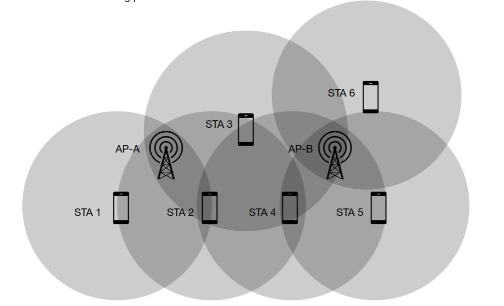
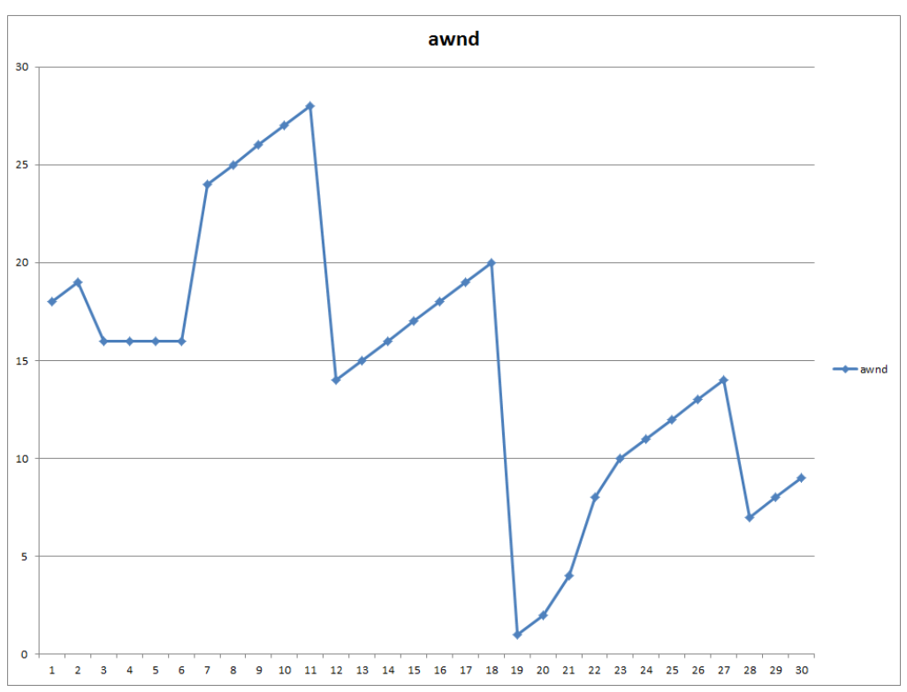

# ETSF10, 2023-05-28

## Question 1

**In the lectures we went through an application that can be used to list the routers packets go through on their way from a source to a destination. The application does not have any limitation in the number of hops visited.**

1. **Name the application.**

Traceroute

2. **The application can be implemented using either different functions of a protocol, or it can use a mix of two protocols. Choose one of the variants and describe how the application uses the protocol functions to list the routers along the way and how it knows when it has reached the final destination.**

> 💡 As described there are two implemetations, but they both are really similar actually. 
> 
> In the _UDP/ICMP method_, the source host sends _UDP packets_ with intentionally high destination port numbers. When the first packet is sent, it has a _Time To Live_ (TTL) set to just `1`. This means that the first router will decrement it to `0`, discard the packet, and then send back an _ICMP Time Exceeded_ message to the source host. From this message, the host running Traceroute can read out the router's IP address, name and whatnot. The second packet has a TTL of `2`, so that **it'll instead reach the next router along the path**, and so on. Once a packet finally reaches the destination (because TTL has increased enough), the destination host will likely reply with _ICMP Destination Uncreachable_ because of the port number.
>
> The other method, _ICMP Echo Request/Reply_, works the same way. But instead of using UDP, the source sends ICMP Echo Request messages with an incrementing TTL. The destination will finally reply with an ICMP Echo Reply when reached.

## Question 2

**Circle the correct answer (only one) of the choices below:**

**An engineer is designing a wireless backhaul link in a WLAN. The link is connecting a central home gateway to a secondary access point in order to extend the coverage area of the main house to also include the guest house. There are two antennas used for the link, one on the outside of the main house and one on the outside of the guest house so the link is a point-to-point link between the two houses. The engineer chooses TDMA where the uplink and downlink take turns as the access method over the link.**

> 💡 TDMA refers to _Time-Division Multiple Access_, in which devices on a link are assigned **evenly distributed time slots** to use the link for transmission.

**Claim: The choice of TDMA/taking turn will always maximise the throughput over the point-to-point link.**

> 💡 This doesn't make sense, since both points may not always be transmitting data. If for example only people in the guest house are transmitting data to the main house, but no data is sent in the other direction, the throughput will be only half of what's possible.

**Reason: TDMA will in this case guarantee the data rate in each direction and even though there are only two nodes in the system, choosing CSMA/CA would still lead to some collisions on the channel. The choice of TDMA will also avoid header overhead and put together, this leads to more data being sent per time unit in each direction as long as there is data queued to be sent.**

> 💡 Since the time slots in TDMA are evenly distributed, the data rate in each direction should be guaranteed, sure. 

a) **Both the proposition and the reason are correct statements, and the reason explains the proposition in a correct way.**

b) **Both the proposition and the reason are correct statements, but the reason does not explain the proposition.**

c) **The proposition is a correct statement, but the reason is an incorrect statement.**

d) **The proposition is incorrect, but the reason is a correct statement.**

e) **Both the proposition and the reason are incorrect.**

The correct alternative is option `d)`.

## Question 3

**Consider the following picture of two 802.11 WLANs:**

**STA1, STA2 and STA3 are associated with AP-A and STA4, STA5 and STA6 are associated with AP-B. The circles show the coverage area of each STA in the centers.**

1) **Assuming that CSMA/CA is used. If the two networks use the same channel, what will happen if STA2 and STA4 transmits to their respective APs simultaneously?**

> 💡 As we can deduce from the picture, `STA 2` is only within range of one access point, `AP-A`, and `STA 4` is only within range of the other access point, `AP-B`. Because of the fact that **collisions occur in the receiver**, this won't lead to any issues since any given access point will only be reached by one transmission each. 

There will be no collision and both transmissions will succeed.

2. **What will happen if instead STA3 and STA5 transmits simultaneously?**

> 💡 In this case, there will be a collision at `AP-B` since both the signals from `STA 3` and `STA 5` will reach it and be sent over the same channel. However, from the perspective of `AP-A`, it will only receive data from the intended source, so no collision occurs here.

The `STA 3`-`AP-A` transmission will succeed, but a collision will occur at `AP-B`, causing the other transmission to fail.

3. **Which transmissions will be successful in each of the two cases above?**

In the first one, both transmissions succeed, whereas only the `STA 3`-`AP-A` succeeds in the next case.

## Question 4

**Consider the following graph of AWND at a host during a TCP data transfer:**

1. **What phase is the congestion avoidance mechanism in during packets 7-11?**

> 💡 We can see a linear increase in the graph. In _Congestion Avoidance_, **the _Advertised Window Size_ (AWND) increases linearly** (e.g., +1 MSS per RTT). This is represented by linear growth in our graph.

Answer: **Congestion avoidance**

2. **