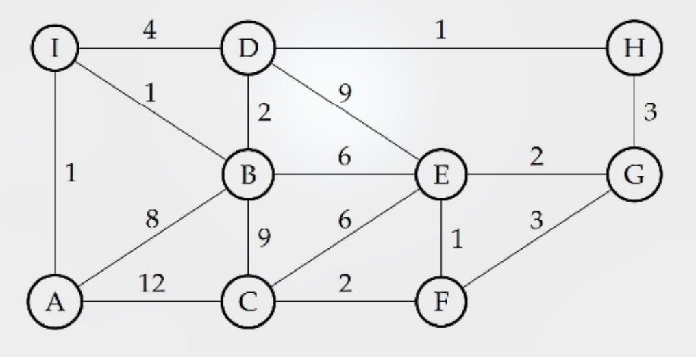
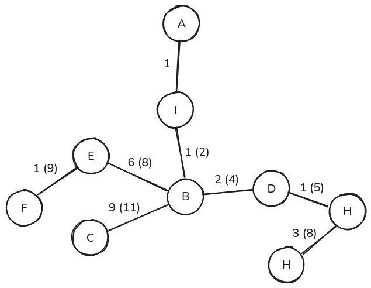
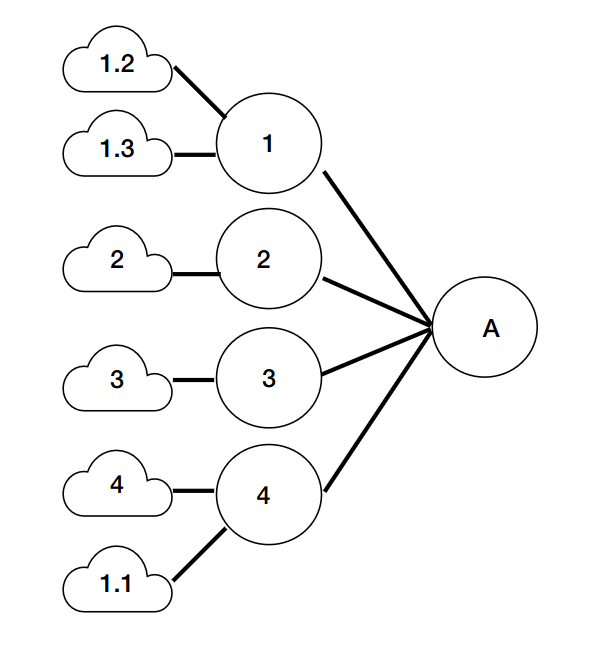
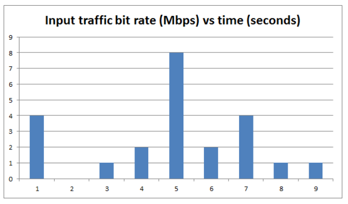
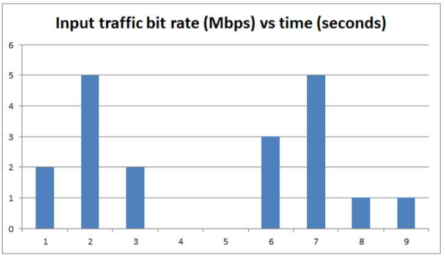

# ETSF10, 2023-05-28

## Question 1

**In the lectures we went through an application that can be used to list the routers packets go through on their way from a source to a destination. The application does not have any limitation in the number of hops visited.**

1. **Name the application.**

Traceroute

2. **The application can be implemented using either different functions of a protocol, or it can use a mix of two protocols. Choose one of the variants and describe how the application uses the protocol functions to list the routers along the way and how it knows when it has reached the final destination.**

> 💡 As described there are two implemetations, but they both are really similar actually. 
> 
> In the _UDP/ICMP method_, the source host sends _UDP packets_ with intentionally high destination port numbers. When the first packet is sent, it has a _Time To Live_ (TTL) set to just `1`. This means that the first router will decrement it to `0`, discard the packet, and then send back an _ICMP Time Exceeded_ message to the source host. From this message, the host running Traceroute can read out the router's IP address, name and whatnot. The second packet has a TTL of `2`, so that **it'll instead reach the next router along the path**, and so on. Once a packet finally reaches the destination (because TTL has increased enough), the destination host will likely reply with _ICMP Destination Uncreachable_ because of the port number.
>
> The other method, _ICMP Echo Request/Reply_, works the same way. But instead of using UDP, the source sends ICMP Echo Request messages with an incrementing TTL. The destination will finally reply with an ICMP Echo Reply when reached.

## Question 2

**Circle the correct answer (only one) of the choices below:**

**An engineer is designing a wireless backhaul link in a WLAN. The link is connecting a central home gateway to a secondary access point in order to extend the coverage area of the main house to also include the guest house. There are two antennas used for the link, one on the outside of the main house and one on the outside of the guest house so the link is a point-to-point link between the two houses. The engineer chooses TDMA where the uplink and downlink take turns as the access method over the link.**

> 💡 TDMA refers to _Time-Division Multiple Access_, in which devices on a link are assigned **evenly distributed time slots** to use the link for transmission.

**Claim: The choice of TDMA/taking turn will always maximise the throughput over the point-to-point link.**

> 💡 This doesn't make sense, since both points may not always be transmitting data. If for example only people in the guest house are transmitting data to the main house, but no data is sent in the other direction, the throughput will be only half of what's possible.

**Reason: TDMA will in this case guarantee the data rate in each direction and even though there are only two nodes in the system, choosing CSMA/CA would still lead to some collisions on the channel. The choice of TDMA will also avoid header overhead and put together, this leads to more data being sent per time unit in each direction as long as there is data queued to be sent.**

> 💡 Since the time slots in TDMA are evenly distributed, the data rate in each direction should be guaranteed, sure. 

a) **Both the proposition and the reason are correct statements, and the reason explains the proposition in a correct way.**

b) **Both the proposition and the reason are correct statements, but the reason does not explain the proposition.**

c) **The proposition is a correct statement, but the reason is an incorrect statement.**

d) **The proposition is incorrect, but the reason is a correct statement.**

e) **Both the proposition and the reason are incorrect.**

The correct alternative is option `d)`.

## Question 3

**Consider the following picture of two 802.11 WLANs:**

**STA1, STA2 and STA3 are associated with AP-A and STA4, STA5 and STA6 are associated with AP-B. The circles show the coverage area of each STA in the centers.**

1) **Assuming that CSMA/CA is used. If the two networks use the same channel, what will happen if STA2 and STA4 transmits to their respective APs simultaneously?**

> 💡 As we can deduce from the picture, `STA 2` is only within range of one access point, `AP-A`, and `STA 4` is only within range of the other access point, `AP-B`. Because of the fact that **collisions occur in the receiver**, this won't lead to any issues since any given access point will only be reached by one transmission each. 

There will be no collision and both transmissions will succeed.

2. **What will happen if instead STA3 and STA5 transmits simultaneously?**

> 💡 In this case, there will be a collision at `AP-B` since both the signals from `STA 3` and `STA 5` will reach it and be sent over the same channel. However, from the perspective of `AP-A`, it will only receive data from the intended source, so no collision occurs here.

The `STA 3`-`AP-A` transmission will succeed, but a collision will occur at `AP-B`, causing the other transmission to fail.

3. **Which transmissions will be successful in each of the two cases above?**

In the first one, both transmissions succeed, whereas only the `STA 3`-`AP-A` succeeds in the next case.

## Question 4

**Consider the following graph of AWND at a host during a TCP data transfer:**

1. **What phase is the congestion avoidance mechanism in during packets 7-11?**

> 💡 We can see a linear increase in the graph. In _Congestion Avoidance_, **the _Advertised Window Size_ (AWND) increases linearly** (e.g., +1 MSS per RTT). This is represented by linear growth in our graph.

Answer: **Congestion avoidance**

2. **What phase is the congestion avoidance mechanism in during packets 19-22?**

> 💡 In this case, we're in _Slow Start_, which we can see from the **exponentially growing value of AWND**. The reason behind this is that AWND increases for every received acknowledgement, which means even further acknowledgements will be receieved afterwards (unless packet loss occurs).

Answer: **Slow start**

3. **What event takes place after packet 11 is received?**

> 💡 Judging by the sudden drop of the AWND, _Packet Loss_ has occured, which leads to the receiver temporarily reducing the AWND.

Answer: **Packet loss**

4. **What event takes place after packet 18 is received?**

> 💡 A TCP _Retransmission Timeout_ (RTO) occurs when the sender is missing too many acknowledgements and **decides to take a time out and stop sending altogether**. Afterwards, it'll gently "test the waters" and sets the _Congestion Window_ (CWND) to `1`, which in turn leads to the effective window to be set to `1`, as we see in the graph.

Answer: **RTO timeout**

5. **Why does AWND remain static during packets 3-6?**

> 💡 The AWND will be equal to the minimum of the CWND and the _Receiver Window_ (RWND). When the AWND isn't changing, it often indicates that the RWND, determined by the receiver, is lower than the CWND.

Answer: **RWND is smaller than CWND**

## Question 5

**Assume that the propagation speed of an electromagnetic field in a cable is 2 x 10 8 m/s. The cable is used as a link between two hosts A and B on a network. The sending host A, sends TCP packets with MSS of 1500 byte to host B. The cable length is 1000 m, the data rate over the link is 10 Gbps and the transmission and processing times are negligible. Also assume there are no errors in the transmission.**

1. **What is the RTT of the link?**

> 💡 Let's first ask ourselves: What is _Round Trip Time_ (RTT)? It's the time it takes for a bit to be propagated from one end to the link and back. 
>
> _v = d / t_
>
> ...where `v` is velocity, `d` is distance, and `t` is time.

2 × 108 = 2000 / RTT\
RTT = 2000 / (2 × 108) = 0.00001 s

Answer: **10 μs**

2. **What is the minimum window size A needs to achieve maximum utilisation? Show your calculations.**

> 💡 We need to figure out how many max-sized segments `A` can buffer to achieve the maximum utalisation. To do that, we first need to check **how many bits are sent in the span of one _Round Trip Time_ (RTT)**. Then we need to **convert that to bytes** so we can **compare it with our _Maximum Segment Size_ (MSS)**.

> 💡 How many bits are sent during one RTT?

0.00001 × 10 × 109 = 100 000 bits

> 💡 Convert to bytes...

100 000 / 8 = 12 500 bytes

> 💡 How many segments worth of _Window Size_ do we need in order to fit 12 500 bytes given that Maximum Segment Size = 1500?

12 500 / 1500 = 8.333... segments

Answer: **We need a window size of at least 9 segments!**

## Question 6

**Given the following network graph: Use Dijkstra’s algorithm to construct the minimum cost spanning tree from node A to all other nodes in the network. Fill in the provided table to illustrate your steps. Also, fill in the resulting forwarding table.**

> 💡 Dijkstra's algorithm, in the course book known as the _Link-State (LS) Algorithm_. We will create a table with one column for "visited" nodes, and one column for each individual node, where we will update the closest path cost (and the previous node in the path) as we iterate through the nodes. I recommend reading about this algorithm in chapter 5, but very simply put, we do the following.
>
> 1. Add initial costs to the neighbours of our start node.
> 2. Look at all unvisited nodes with a calculated cost in our table. Pick the one with the least cost (`N`) and add it to `Visited` in the next iteration.
> 3. Now, in the new iteration, for each neighbor of `N`, update its cost if the path via `N` is shorter.
> 4. Repeat from step `2.` until all nodes are visited.

| Visited   | A   | B    | C     | D    | E    | F    | G    | H    | I    |
| --------- | --- | ---- | ----- | ---- | ---- | ---- | ---- | ---- | ---- |
| A         | 0   | 8, A | 12, A | -    | -    | -    | -    | -    | 1, A |
| AI        |     | 2, I |       | 5, I | -    | -    | -    | -    |      |
| AIB       |     |      | 11, B | 4, B | 8, B | -    | -    | -    |      |
| AIBD      |     |      |       |      |      | -    | -    | 5, D |      |
| AIBDH     |     |      |       |      |      | -    | 8, H |      |      |
| AIBDHE    |     |      |       |      |      | 9, E |      |      |      |
| AIBDHEG   |     |      |       |      |      |      |      |      |      |
| AIBDHEGF  |     |      |       |      |      |      |      |      |      |
| AIBDHEGFC |     |      |       |      |      |      |      |      |      |

> 💡 How do we use this table to construct the forwarding table? For any given destination node, we can look at its most recent value in our table. There we will find the cost, as well as the previous node for which we in turn can look up the previous node until we are back at `A`.

| Destination | Next hop | Cost |
| ----------- | -------- | ---- |
| A           | -        | 0    |
| B           | I        | 2    |
| C           | I        | 11   |
| D           | I        | 4    |
| E           | I        | 8    |
| F           | I        | 9    |
| G           | I        | 8    |
| H           | I        | 5    |
| I           | -        | 1    |

> 💡 To draw our _Minimum Cost Spanning Tree_, we will make our source node, `A`, the root. From there, we add branches **representing the shortest route taken to any given destination**. Below is mine which shows both the link cost and the total cost (within parentheses).

## Question 7

**A network administrator has a private network with address 192.168.0.0/24. She wants to divide the network into four equal subnets (1-4) belonging to different parts of the organisation.**

> 💡 Let's analyze. The private network address, `192.168.0.0` uses `24` bits to identify the net ID, or the **first three octets**.
>
> `11000000.10101000.00000000.XXXXXXXX` thus covers all possible addresses.

**What is the network address and netmask of the four subnets?**

> 💡 To divide the network further into four equal subnets, we need additional space for four different binary values in the net ID. `00`, `01`, `10` and `11`. As we can see, this requires **two bits** of additional subnet mask. Our subnet mask for these individual subnets will therefore be `/26`. Let's now translate the following to decimal.
>
> `11000000.10101000.00000000.00000000` → `192.168.0.0`
> `11000000.10101000.00000000.01000000` → `192.168.0.64`
> `11000000.10101000.00000000.10000000` → `192.168.0.128`
> `11000000.10101000.00000000.11000000` → `192.168.0.192`

Answer:
- 192.168.0.0/26
- 192.168.0.64/26
- 192.168.0.128/26
- 192.168.0.192/26

**She now wants to subnetwork the first subnet into 3 networks (1.1-1.3) where the first network has half the address space and the two other networks have an equal quarter of the address space.**

**What is the network address and net mask of the three subnets and how many hosts can they each have?**

> 💡 This time we need to divide `11000000.10101000.00000000.00XXXXXX` even further. My strategy would be to divide this in four once again and then merge the first two, but as a friend with a quicker brain than mine pointed out (no, not ChatGPT), we can actually do it all in one step. First, we split our subnet in half by adding yet another bit to our subnet mask. `11000000.10101000.00000000.00NXXXXX`. When `N` is `0`, that leaves room to `32` addresses, and when `N` is `1`, we have another `32`. Now we split the second one (where `N` is `1`) once again by adding yet another bit to the subnet mask. `11000000.10101000.00000000.001KXXXX`, where `K` is either `1` or `0`.
> 
> `11000000.10101000.00000000.00000000` → `192.168.0.0`
> `11000000.10101000.00000000.00100000` → `192.168.0.32`
> `11000000.10101000.00000000.00110000` → `192.168.0.48`

> 💡 Also recall that each subnet has **two reserved addresses**. One for the network itself (often the gateway), and one for broadcasting.

Answer:
- 192.168.0.0/27
- 192.168.0.32/28
- 192.168.0.48/28
- 30, 14 and 14 hosts respectively

**Now she wants to move the larger of the three subnets to reside behind the router to the fourth of the original four subnets. Fill in the routing table of router A to reflect the subnet configuration.**

| Destination      | Next hop |
| ---------------- | -------- |
| 192.168.0.0/26   | 1        |
| 192.168.0.64/26  | 2        |
| 192.168.0.128/26 | 3        |
| 192.168.0.192/26 | 4        |
| 192.168.0.0/27   | 4        |

**What routing information is router A advertising to the outside world in its most compact form?**

> 💡 An address which **matches with all of the subnets listed above**.

Answer: **192.168.0.0/24 through me**

## Question 8

**In the figure the input data rate to a leaky bucket traffic shaper is shown. At the times indicated, bursts of 1s length happen. The leaky bucket has a maximal output rate of 4 Mbps.**

> 💡 We will think of a leaky bucket in networking as a real-life leaky bucket. Water may come into the bucket in bursts, but the leak ensures a maximum output flow.

**What is the actual data output rate from the Leaky Bucket for each time unit. Assume the bucket to be infinite.**

> 💡 Maximum of `4 Mbps`! But remember that **if a higher number of bits entered the bucket in a previous time frame, it would continue leaking into the new one.**

1. **1 s**
   > 💡 We aren't past the max output rate, so should just be `4 Mbps`
   
   Answer: **4 Mbps**
2. **2 s**
   > 💡 We don't have any buffered data from the last frame, and no new data comes in during this time frame.
  
   Answer: **0 Mbps**

3. **3 s**
   > 💡 Same logic as in `1.`.
  
   Answer: **1 Mbps**
4. **4 s**
   > 💡 Same logic as in `1.`.
  
   Answer: **2 Mbps**

**Now, the figure below shows the input data rate to a token bucket traffic shaper. The token bucket has a fill rate of 2Mbps and at start time there is 1Mbit tokens in the bucket. Assuming that all available tokens can be used during a time slot, and that all tokens and input traffic arrives at the beginning of a slot, what is the output rate from the traffic shaper**

> 💡 Token buckets work a bit differently. Here, aside from input data, a number of _tokens_ are added every time frame. **For every bit the bucket outputs, it spends one token**. 

1. **At time 1 s**
   > 💡 We start with `1 Mbit` of tokens and receive an additional `2 Mbit` every second. So for this time frame, we'll have `3 Mbps` of max output, but we'll only need to spend `2 Mbit` since that's all the input we're getting.

   Answer: **2 Mbps**
2. **At time 2 s**
   > 💡 Our bucket will still have `1 Mbit` of tokens left from the previous frame, and receive `2 Mbit` additionally. We'll need to consume all of them.

    Answer: **3 Mbps**
3. **At time 3 s**
   > 💡 We receive `2 Mbit` worth of new tokens, and have `2 Mbit` of data passed over from the previous second as well as `2 Mbit` from this one. We'll consume all our `2 Mbit` of tokens.

    Answer: **2 Mbps**
4. **At time 4 s**
   > 💡 We will transmit the remaining `2 Mbit` passed over from the previous frame.
   
   Answer: **2 Mbps**
