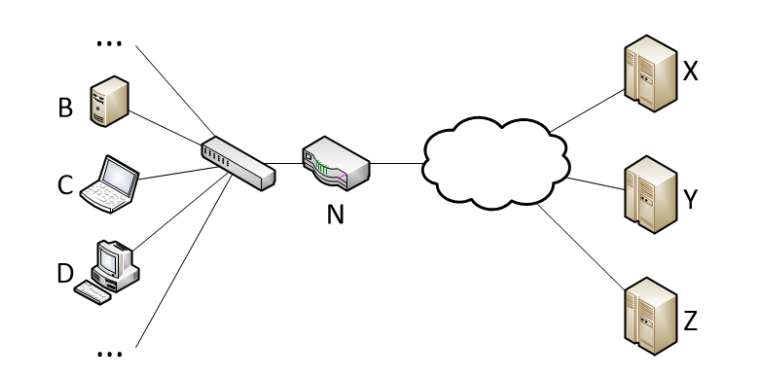
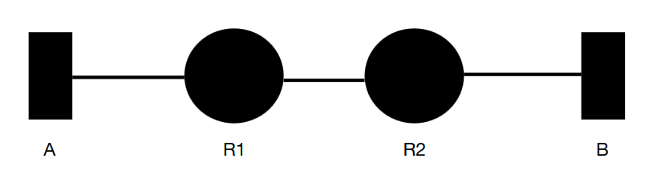

# ETSF10, 2024-08-21

## Question 1

**Two hosts are connected with a point to point link. The data rate of the link is 100 Mbit/s and data is sent continuously. The minimum receive window size (so that the receive buffer does not run the risk of overflowing) is 10.000 byte. What is the RTT of the link? Show your calculation.**

> The receive window size _W_ must be at least as large as the _Bandwidth-Delay Product_ (BDP) to prevent overflow. The BDP is the product of the data rate and the RTT.

W = BDP = R × RTT

Solving for RTT:

RTT = W / R = 80000 / 100000000 = 0.0008

Answer: **0.8ms**

## Question 2

**A router has the following forwarding table for the same output port:**

| Network ID | Net mask |
| ---------- | -------- |
| 10.0.0.128 | /25      |
| 10.0.0.0   | /25      |
| 10.0.1.0   | /24      |
| 10.0.4.0   | /23      |
| 10.0.2.0   | /23      |

**First aggregate the table as much as possible and then answer the following question.**

**What is the id of the network to which the adress 10.0.1.14 belongs?**

_Answer in the example form 192.168.100.0 /24 or 192.168.100.0/255.255.254.0_

> The first entry in the original routing table will match with IP addresses of the type `00001010.00000000.00000000.1XXXXXXXX`. The second one, `00001010.00000000.00000000.0XXXXXXX`. These two entries can therefore be merged into just one entry covering that entire range: `00001010.00000000.00000000.XXXXXXXX`. This means only the first _24_ bits will identify the subnet, so the subnet mask of the merged entry is `/24`. With this merge, **we do not lose any coverage**.

| Network ID | Net mask |
| ---------- | -------- |
| 10.0.0.0   | /24      |
| 10.0.1.0   | /24      |
| 10.0.4.0   | /23      |
| 10.0.2.0   | /23      |

> Now we have two entries with the subnet mask `/24`. In binary, the IDs are `00001010.00000000.00000000.XXXXXXXX` and `00001010.00000000.00000001.XXXXXXXX` respectively. By decreasing the subnet mask number to `23`, we can merge these two into a new entry. We get `10.0.0.0/23`.

| Network ID | Net mask |
| ---------- | -------- |
| 10.0.0.0   | /23      |
| 10.0.4.0   | /23      |
| 10.0.2.0   | /23      |

> We can finally merge `10.0.2.0/23` with our new `10.0.0.23/23`. The result will be an entry with the network ID `10.0.0.0`, but with a net mask of only `/22`. That way, It'll cover all addresses `00001010.00000000.000000XX.XXXXXXXX`.

Final aggregated table:

| Network ID | Net mask | Coverage                            |
| ---------- | -------- | ----------------------------------- |
| 10.0.0.0   | /22      | 00001010.00000000.000000XX.XXXXXXXX |
| 10.0.4.0   | /23      | 00001010.00000000.0000010X.XXXXXXXX |

As for the question, the IP address `10.0.1.14` in binary looks like `00001010.00000000.00000001.00001110`. As we can see, the only prefix match is with our first entry, so the **network ID is therefore `10.0.0.0/22`**.

## Question 3

**Router X has the following routing table:**

| Network | Hops | Next hop |
| ------- | ---- | -------- |
| Net2    | 6    | A        |
| Net3    | 4    | C        |
| Net4    | 3    | A        |
| Net6    | 2    | C        |
| Net7    | 3    | B        |

**It receives the following RIP update message from a neighbour D:**

| Network | Hops |
| ------- | ---- |
| Net2    | 1    |
| Net4    | 6    |
| Net5    | 1    |
| Net6    | 1    |
| Net7    | 5    |

**Fill in the following table with the new routing table X has and will advertise after the update. If a field is not applicable/not used fill in “N/A”.**

> The strategy is to compare the current paths we have with those we could create via our neighbour `D`. We should note however, that moving to `D` also means hopping once. In our case, we could create an entry to `Net5` and update our path to `Net2`.

| Network | Hops | Next hop |
| ------- | ---- | -------- |
| Net1    | N/A  | N/A      |
| Net2    | 2    | D        |
| Net3    | 4    | C        |
| Net4    | 3    | A        |
| Net5    | 2    | D        |
| Net6    | 2    | C        |
| Net7    | 3    | B        |

## Question 4



**Given the figure above. The host addresses are given below:**

`B = 192.168.1.11`\
`C = 192.168.1.12`\
`D = 192.168.1.13`

`X = 201.10.3.14`\
`Y = 13.85.34.123`\
`Z = 145.234.10.73`

**`N` is a router with an address translator with a single global external address.**

**Add partial entries to router `N`’s _NAPT table_ as the following events take place in numbered order in the sub questions below.**

_For known port numbers, insert the actual number and for port numbers taken from a list of available but non-allocated port numbers use “unused”. If an event cannot take place write “N/A”. Internal refers to the private network and external to the NAT’s public network side_

1. **NetAdmin configures port forwarding for HTTP to B**

> The internal IP address is the one used within the LAN (to the left of the router `N` in the picture). In our case, it'll simply be the IP address of `B`: `192.168.1.11`. The HTTP protocol defaults to port `80`, so the internal port will therefore be set to `80`. Port `80` is not in use externally, so it'll be set as the external port as well.

Internal IP Address: `192.168.1.11`\
Internal port: `80`\
External port: `80`

2. **Y opens up an SMTP connection to D**

> Here, an external host attempts to initiate a SMTP connection to host `D`. SMTP uses port `25`, for which we do not have a port forwarding rule for. From an external point of view, `D`'s IP address cannot be known as it is behind `N`.

N/A

3. **B opens up a HTTP connection to Z**

> The explanation I, with my loyal LLM instance, came to find was that when `B` tries to initiate a new HTTP connection with an external host (`Z`), a random unused port is selected internally and another random unused port is selected externally. In the new entry, they are mapped together with the internal IP address set to, you guessed it, `B`'s address `192.168.1.11`. Note that the internal and external port numbers don't have to be equal. They are randomly selected independantly and are mapped together with this new NAPT entry.

Internal IP Address: `192.168.1.11`\
Internal port: `unused`\
External port: `unused`

4. **Z opens up a HTTP connection to N**

> Here, an external host opens a HTTP connection to our router, `N`. By default, the port used from the external request will be `80`, since it's HTTP. Because of event 1, our router does have a port fortwarding rule for that port! This means that **no new entry is created**, but the traffic is directed to the IP address of host `B`, internal port `80`.

No new entry, but traffic directed (according to previously configured port forwarding rule) to `192.168.1.11:80` internally. External port: `80` (HTTP).

5. **X opens up a HTTP connection to N**

> Same logic as previous event applies here.

No new entry, but traffic directed (according to previously configured port forwarding rule) to `192.168.1.11:80` internally. External port: `80` (HTTP).

## Question 5

**A client is sending a message to a server using TCP. The following words are sent across the network (disregard header information etc.):**

`0101001101100110; 0111010010110100; 0000110111000001`

**Calculate the checksum TCP adds to the message to be sent. Provide your calculation below.**

> To calculate the checksum, we must sum all words, wrapping around potential overflows, then taking the ones complement.

```
   1111111111  1
   0101001101100110
   0111010010110100
+  0000110111000001
-------------------
   1101010111011011
```

> This time we didn't encounter any overflow, which is lucky. In other cases, overflow would be handled by shifting the overflow to the right, then adding it again to our number.

Ones complement of sum (flipping ones and zeros): `0010101000100100` <- checksum!

**Now assume that the client sent the following bit sequence: 01011101 111100010 and the checksum that was sent was 00110010 00001101, was the transmitted message received correctly? Show your calculation below.**

> This question most likely has a mistake in it, since the bit sequence is of length `17`. In internet checksumming they should always be `16`.

## Question 6

a) **Show how TCP estimates the RTT value (ERTT) for 4 measured RTT samples (SRTT). SRTT 1 is the most recent sample, SRTT 2 the second most recent sample etc.**

> We can use the following formula.
> 
> EstimatedRTT = (1 - α) × EstimatedRTT + α × SampleRTT
>
> Here, we reference the previous estimated round trip time (set to `0` in the first iteration). α has a "recommended value" of `0.125`. 

ERTT<sub>1</sub> = (1 - 0.125) × 0 + 0.125 × SRTT<sub>4</sub> 

> Now we can use our previous result to describe TCP estimation like the following.

ERTT<sub>2</sub> = (1 - 0.125 ) × ERTT<sub>1</sub> + 0.125 × SRTT<sub>3</sub>

ERTT<sub>3</sub> = (1 - 0.125 ) × ERTT<sub>2</sub> + 0.125 × SRTT<sub>2</sub>

ERTT<sub>4</sub> = (1 - 0.125 ) × ERTT<sub>3</sub> + 0.125 × SRTT<sub>1</sub>

b) **Derive a formula for ERTT when the number of samples are n instead.**

> I tried to generalize the steps above where we have a costant number of samples, `n`, and `i` which is our parameter. I'm not great at math, but testing this recursive formula against the steps in step `a)` works out!

ERTT<sub>i</sub> = (1 - α) × ERTT<sub>i - 1</sub> + α × SRTT<sub>n-i+1</sub>

...where ERTT<sub>0</sub> = 0

c) **Referring to the formula above, why is the procedure called an exponential moving average?**

> Per the book, section 3.5.3.

The word "exponential" appears in EWMA because the weight of a given SampleRTT decays exponentially fast as the updates proceed.

d) **Why does TCP not include SRTT from retransmitted packets in its calculation?**

When a packet is retransmitted, TCP cannot reliably determine whether an incoming ACK corresponds to the original transmission or the retransmission.

> An example which helped me understand this:
>
> Suppose Packet #1 is sent at time t=0, lost, and retransmitted at t=500ms.
> If an ACK arrives at t=600ms, is it acknowledging the first transmission (RTT = 600ms) or the retransmission (RTT = 100ms)?

## Question 7



**Consider the figure above. Host A is sending TCP packets via routers R1 and R2 to host B. For each TCP segment, a TCP header of 20 byte is added. The MTU of the links are; A-R1 = 1024 byte including 14 byte Link layer header, R1-R2 = 512 byte including an 8-byte Link layer header and link R2-B = 512 byte including a 12 byte link layer header. Host A sends a TCP segment with 900 byte data (no header included) via IP to B. Fill in the following values for the IP header of all packets over the three links:**

**Length, DF, MF, Offset**

**Link A-R1**

> This first link has a maximum transmission unit of `1024 bytes`. If we exclude its own headers, the max payload size is `1010 bytes`. When host `A` prepares the IP datagram, the payload will include the TCP header TCP data (20 + 900 = 920 bytes) Then adding the IP header size, `20`, gives us a total packet size of `940 bytes`. This is well below the max payload size of the link, which means we don't need any fragmentation.

Packet #1.1

| Property | Value     |
| -------- | --------- |
| Length   | 940 bytes |
| DF       | 0         |
| MF       | 0         |
| Offset   | 0         |


**Link R1-R2**

> This time, the MTU is only `512 bytes`. With link-layer header size of `8 bytes`, that only leaves `504 bytes` of max payload. This means that we need to fragment the IP packet. Our first fragment will consist of as much data as we can plus an IP header. Another rule to know is that **each fragment payload size must be a multiple of 8 bytes (except the last one).** Knowing this, we will construct a fragment with `20 bytes` of IP header and `480 bytes` of IP payload. 

Packet #2.1

| Property | Value     |
| -------- | --------- |
| Length   | 500 bytes |
| DF       | 0         |
| MF       | 1         |
| Offset   | 0         |

> After already having sent `480 bytes` of our IP payload, `440` remains (920 - 480 = 440). Let's add a `20 byte` IP header, then send it! This is the last fragment, so `MF` (more fragments) will be set to `0`. As mentioned, we've already sent `480 bytes` of IP payload. To determine the offset, we divide that number with `8` and get `60`!

Packet #2.2

| Property | Value     |
| -------- | --------- |
| Length   | 460 bytes |
| DF       | 0         |
| MF       | 0         |
| Offset   | 60        |


**Link R2-B**

> Let's assume that `Packet #2.1` arrives to `R2` first. After link decapsulation, it has a length of `500 bytes`. For our next link, we have an MTU of `512 bytes`, and after excluding the link layer header size, both our packets should still fit!

Packet #3.1

| Property | Value     |
| -------- | --------- |
| Length   | 500 bytes |
| DF       | 0         |
| MF       | 1         |
| Offset   | 0         |

Packet #3.2

| Property | Value     |
| -------- | --------- |
| Length   | 460 bytes |
| DF       | 0         |
| MF       | 0         |
| Offset   | 60        |

## Question 8

**Suppose an 11Mbps WLAN is transmitting 64 byte frames back to back (without waiting time in-between) over a radio channel with a bit error rate of 10<sup>-7</sup> . How many frames per second will contain errors on average? Show your calculations.**

> I will start by converting the frame size to bits.

Frame size = 8 × 64 = 512 bits

> Now my method will be to figure out what the probability is for one frame to be corrupted is, then multiply that with how many frames fit within one second.

Chances of a **not corrupted** frame = (1 - 10<sup>-7</sup>)<sup>512</sup>

Chances of **corrupted** frame is therefore 1 minus that.

Packets per second = 11 000 000 / 512 = 21484.375

Corrupt frames per second = 21484.375 × (1 - (1 - 10<sup>-7</sup>)<sup>512</sup>) = **1.09997189504 frames per second**

Answer: **~1.1 frames per second are corrupted**